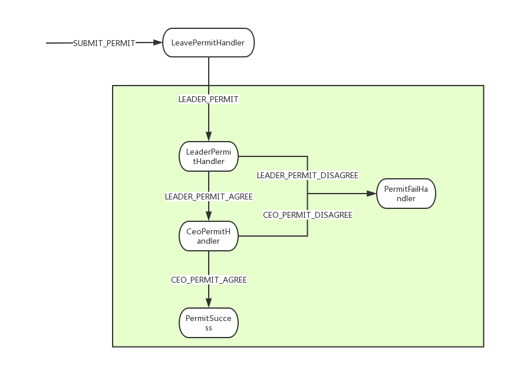

**背景**

之前18年曾经写过一篇关于状态机的博客，链接如下:
 [https://www.jianshu.com/p/8def04b34b3c](https://www.jianshu.com/p/8def04b34b3c)
在楼主当初的设计过程中，已经认为是非常完美的一篇关于状态机的文章了，后续，做相关交易系统的时候，觉得该状态机还是太重，过于复杂，于是，便重新设计了一套极简状态机，为什么说是极简状态机，因为这套状态机太过于简单，只有仅仅几个类，而且，轻依赖，仅仅依赖于lombok.jar和slf4j，用于生成set，get方法和打印日志。

**为什么需要状态机**

 还是和上文一样，举个请假的例子，当我们需要请假的时候，首先需要领导审批，领导审批完成ceo审批，当然，并不是所有假条都能够审批完成，也有可能CEO拒绝这个假单，也可能直线领导拒绝这个假单，随着不同的审批意见，则会有不同的流程，去处理假条。
在这里，我们把假单看成业务单(可以是交易单，也可以是业务订单)，状态机就是整个审批过程(审批过程的过程，审批链就是状态机)，而审批意见就决定了状态机走哪条路。

**举例**

我们还是拿着请假来说事，先想想我们请假需要经过的几个步骤。
* 提交假条
* 领导审批
* ceo审批


当然，也可能是到了领导，或者ceo审批终止，请假失败。
所以我们需要一个枚举类，来定义我们需要的步骤。
```java
public enum LeavePermitState {
    SUBMIT_PERMIT,//提交假单
    LEADER_PERMIT,//领导审批
    CEO_PERMIT,//CEO审批
}
```
知道了该找谁批假条，也得看领导或者ceo批还是不批，所以还需要审批意见，在这里用一个枚举来定义,叫做event。这里为什么会有提交假单和领导审批，因为当你写完假单之后，你就自己会去找领导审批，而非有其他人督促你去提交假单，也就意味着有些步骤是你自己去驱动，自己决定要不要往下走。对于需要外部的意见，就只能等外部意见再接着走了。
```java
public enum LeavePermitEvent {
    SUBMIT_PERMIT,//提交假单
    LEADER_PERMIT,//领导审批
    LEADER_PERMIT_AGREE,//领导审批通过
    LEADER_PERMIT_DISAGREE,//领导审批不通过
    CEO_PERMIT_AGREE,//ceo审批通过
    CEO_PERMIT_DISAGREE,//ceo审批不通过
}
```
审批动作和相关审批意见都已经有了，怎么把动作和审批意见关联起来，也就是状态机刻画出来，状态机怎么知道，这个意见是到了哪个动作去处理的？先画个图:

解释一下:
当我们需要请假的时候，首先拿一个请假条(Event就是SUBMIT_COMMIT)，然后填写相关请假信息(LeavePermitHandler)，然后找领导审批(Event就是LEADER_PERMIT，意思是找领导审批),领导审批就会有两种不同意见，同意或者不同意，如果同意，则就要ceo审批，如果不同意，整个假条就失败了。ceo审批通过，则请假成功，假条才会到成功状态。怎么把这一系列动作刻画出来？在状态机里，可以在Spring上下文创建完成，加载状态机相关配置，也可以在静态方法中初始化。
```java
public class StatemachineInit {

    //初始化状态机
    public static  void init(){
        //支持多状态机 这里以请假为例，可以支持多种
        StateMachineFactory.register("LEAVE_PERMIT",buildLeavePermitStateMachine());

    }

    private static StateMachine buildLeavePermitStateMachine() {
        StateMachineConfig<LeavePermitState,LeavePermitEvent,Handler> stateMachineConfig=new StateMachineConfig();

        stateMachineConfig.from(LeavePermitState.SUBMIT_PERMIT)//初始状态，提交假单
                .permit(LeavePermitEvent.SUBMIT_PERMIT) //拿假条
                .handle(new SubmitLeavePermitHandler())//填假条
                .to(LeavePermitState.LEADER_PERMIT) //填完之后，到领导审批
                 .build();

        stateMachineConfig.from(LeavePermitState.LEADER_PERMIT) //领导审批
                .permit(LeavePermitEvent.LEADER_PERMIT)  //待审批
                .handle(new LeaderPermitHandler())     //领导查阅
                .to(LeavePermitState.LEADER_PERMIT)    //查阅完，仍旧是领导审批状态
                .build();


        stateMachineConfig.from(LeavePermitState.LEADER_PERMIT) //领导审批
                .permit(LeavePermitEvent.LEADER_PERMIT_AGREE)   //领导同意
                .handle(new CeoPermitHandler())                 //领导同意之后CEO审批
                .to(LeavePermitState.CEO_PERMIT)                //ceo审批
                .build();

        stateMachineConfig.from(LeavePermitState.LEADER_PERMIT)  //领导审批
                .permit(LeavePermitEvent.LEADER_PERMIT_DISAGREE) //领导不同意
                .handle(new PermitFailHandler())                //假条失败
                .build();

        stateMachineConfig.from(LeavePermitState.CEO_PERMIT)   //CEO审批
                .permit(LeavePermitEvent.CEO_PERMIT_AGREE)      //ceo审批同意
                .handle(new PermitSuccessHandler())             //假条成功
                .build();


        stateMachineConfig.from(LeavePermitState.CEO_PERMIT)       //ceo审批
                .handle(new PermitFailHandler())                //ceo审批不通过
                .permit(LeavePermitEvent.CEO_PERMIT_DISAGREE)      //假条失败
                .build();

        return new StateMachine(stateMachineConfig);
    }
}
```
程序到底如何运行，才能跑起来？
```java
 public static void main(String[] args){
        //初始化状态机
        StatemachineInit.init();
        log.info("创建假单");
        //创建上下文
        TransactionContext transactionContext=new TransactionContext();
        transactionContext.setData(LeavePermitContextConstants.CURRENT_STATE, LeavePermitState.SUBMIT_PERMIT);
        //开始请假，从拿请假条开始
        StateMachineFactory.getStateMachine("LEAVE_PERMIT").fire(LeavePermitEvent.SUBMIT_PERMIT, transactionContext);

        //拿假条，填写假条之后，需要领导审批
        log.info("领导审批");
        LeavePermit leavePermit=(LeavePermit)transactionContext.getData(LeavePermitContextConstants.LEAVE_PERMIT);
        TransactionContext transactionContext2=new TransactionContext();
        transactionContext2.setData(LeavePermitContextConstants.LEAVE_PERMIT,leavePermit);
        transactionContext2.setData(LeavePermitContextConstants.CURRENT_STATE, LeavePermitState.LEADER_PERMIT);
        //领导审批通过，同意该假单
        StateMachineFactory.getStateMachine("LEAVE_PERMIT").fire(LeavePermitEvent.LEADER_PERMIT_AGREE, transactionContext2);

        log.info("ceo审批");
        LeavePermit leavePermit2=(LeavePermit)transactionContext.getData(LeavePermitContextConstants.LEAVE_PERMIT);
        TransactionContext transactionContext3=new TransactionContext();
        transactionContext3.setData(LeavePermitContextConstants.LEAVE_PERMIT,leavePermit2);
        transactionContext3.setData(LeavePermitContextConstants.CURRENT_STATE, LeavePermitState.CEO_PERMIT);
        
          //ceo审批通过
        StateMachineFactory.getStateMachine("LEAVE_PERMIT").fire(LeavePermitEvent.CEO_PERMIT_AGREE, transactionContext3);
    }
```
有种类似开车的场景，状态机就像地图，指示牌就是Event，然后汽车是假条，当汽车走到某一个路口，会按照指示牌选择不同的路走，假条也是按照不同的Event(审批意见)在走，状态机和假条之前并没有必然关系，都是线程所有。不存在并发问题，就像汽车走在路上，然而路并和汽车没有关系，只是因为汽车上走的是路，所以状态机与业务并没有关系，而是业务跑在状态机上。
运行结果:
```txt
4:27:20.933 [main] INFO com.github.shxz130.statemachine.demo.main.Main - 创建假单
14:27:20.940 [main] INFO com.github.shxz130.statemachine.core.fire.StateMachine - [StateMachine] runing currentState=[SUBMIT_PERMIT], event=[SUBMIT_PERMIT], handle=[SubmitLeavePermitHandler], nextState=[LEADER_PERMIT]
14:27:20.944 [main] INFO com.github.shxz130.statemachine.demo.config.handler.SubmitLeavePermitHandler - [SubmitLeavePermitHandler],permit=[LeavePermit(permitNo=PERMITN, status=INIT)]
14:27:20.944 [main] INFO com.github.shxz130.statemachine.core.fire.StateMachine - [StateMachine] runing currentState=[LEADER_PERMIT], event=[LEADER_PERMIT], handle=[LeaderPermitHandler], nextState=[LEADER_PERMIT]
14:27:20.944 [main] INFO com.github.shxz130.statemachine.demo.config.handler.LeaderPermitHandler - [LeaderPermitHandler],permit=[LeavePermit(permitNo=PERMITN, status=LEADER_PERMIT)]
14:27:20.944 [main] INFO com.github.shxz130.statemachine.demo.config.handler.LeaderPermitHandler - 等待领导审批
14:27:20.944 [main] INFO com.github.shxz130.statemachine.demo.main.Main - 领导审批
14:27:20.945 [main] INFO com.github.shxz130.statemachine.core.fire.StateMachine - [StateMachine] runing currentState=[LEADER_PERMIT], event=[LEADER_PERMIT_AGREE], handle=[CeoPermitHandler], nextState=[CEO_PERMIT]
14:27:20.945 [main] INFO com.github.shxz130.statemachine.demo.config.handler.CeoPermitHandler - [CeoPermitHandler],permit=[LeavePermit(permitNo=PERMITN, status=CEO_PERMIT)]
14:27:20.945 [main] INFO com.github.shxz130.statemachine.demo.config.handler.CeoPermitHandler - 等待ceo审批
14:27:20.945 [main] INFO com.github.shxz130.statemachine.demo.main.Main - 领导审批
14:27:20.945 [main] INFO com.github.shxz130.statemachine.core.fire.StateMachine - [StateMachine] runing currentState=[CEO_PERMIT], event=[CEO_PERMIT_AGREE], handle=[PermitSuccessHandler], nextState=[null]
14:27:20.945 [main] INFO com.github.shxz130.statemachine.demo.config.handler.PermitSuccessHandler - [PermitSuccessHandler],permit=[LeavePermit(permitNo=PERMITN, status=SUCCESS)],审批意见:[{}]
Disconnected from the target VM, address: '127.0.0.1:61095', transport: 'socket'
```
这个例子写的比较粗，懂其意思即可。
感兴趣的可以看源码，我把状态机核心和demo做了分离，了解使用，仅关心demo即可，想了解原理，查看core即可。
欢迎fork交流。
